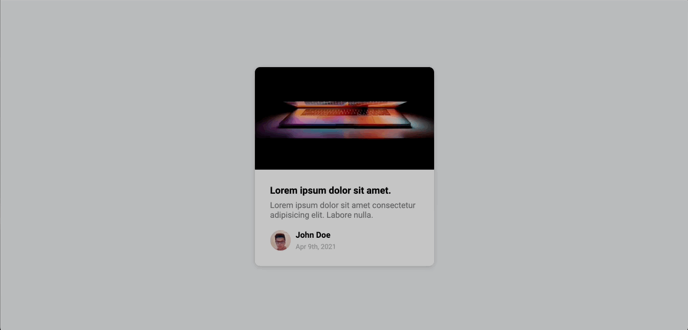

## Project Title

Content Placeholder

## Purpose

As a new developer, I want to do a daily coding project tutorial to learn new features and deepen my understanding of Web Development.

## Description

A content placeholder card that has a gradient animation when it loads.

## Demo

https://curtiskil.github.io/content-placeholder/

## Contributors

Brad Traversy. Florin Pop.
